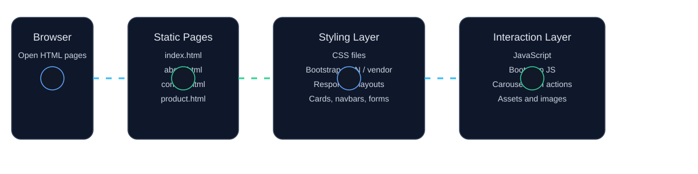

# TurnagoIT & TTC Web Design Level 03 Batch 02

## Contents

- [Description](#description)
- [Key Features](#key-features)
- [Tech Stack](#tech-stack)
- [Project Structure](#project-structure)
- [Page Map](#page-map)
- [Getting Started](#getting-started)
- [Environment Variables](#environment-variables)
- [Usage / Examples](#usage--examples)
- [Alternative Functionalities](#alternative-functionalities)
- [License](#license)
- [Contact](#contact)

## Description

This repository contains a collection of static front-end web design practice projects created during the TurnagoIT and TTC Web Design Level 03 Batch 02 learning program. The workspace includes multiple HTML/CSS/Bootstrap exercises, landing pages, and e-commerce-style mockups built as standalone classroom assignments.

The project is designed for learners who want to practice:

- Building responsive pages with HTML and CSS
- Applying Bootstrap components for layout and UI
- Creating multi-page static websites
- Working with local assets such as images, stylesheets, and scripts

> This repository is a collection of exercise folders and demo pages, not a single production application with a backend or database.

[Back to Contents](#contents)

## Key Features

- **Multi-class learning structure:** The repository is organized into separate class folders, each containing its own HTML/CSS/Bootstrap exercise.
- **Static page-based workflow:** Most pages are plain HTML files that can be opened directly in a browser or served locally.
- **Bootstrap-based UI practice:** Several folders use Bootstrap CDN or local vendor assets to demonstrate layout, navigation, cards, carousel, and forms.
- **E-commerce mockup pages:** Class 28 and Class 29 include homepage, product listing, product details, login, and signup pages.
- **Corporate-style landing pages:** Class 31 and Class 33 include home, about, contact, and FAQ pages for a TTC-themed website.
- **Asset-rich sample content:** The project includes local images, banners, and supporting CSS/JS files for demonstration purposes.
- **Reusable front-end reference material:** Older and practice folders provide extra examples for comparison and study.

[Back to Contents](#contents)

## Tech Stack

| Category              | Used In This Project                                |
| --------------------- | --------------------------------------------------- |
| Markup                | HTML5                                               |
| Styling               | CSS3                                                |
| Front-end framework   | Bootstrap 5.2.3 and 5.3.8                           |
| Client-side scripting | JavaScript                                          |
| Assets                | AVIF, JPG, PNG, SVG, WebP                           |
| Local preview         | Browser, VS Code Live Server, or Python HTTP server |

[Back to Contents](#contents)

## Project Structure

```text
TurnagoIT-and-TTC-Web-Design-Level-03-Batch-02/
├── README.md
├── class-1/
├── Class-2/
├── Class-3/
├── Class-4/
├── Class-6/
├── Class-8/
├── Class-9/
├── Class-10/
├── Class-11/
├── Class-12/
├── Class-13/
├── class-14/
├── class-15/
├── class-16/
├── class-18/
├── class-19/
├── class-21/
├── class-22/
├── class-23/
├── Class-24/
├── Class-25/
├── Class-26/
├── Class-27/
├── Class-28/
├── Class-29/
├── Class-30/
├── Class-31/
├── Class-32/
├── Class-33/
├── Previous QS/
└── .git/
```

### Main content areas

- **Basic HTML/CSS exercises:** `Class-1`, `Class-2`, `Class-3`, `Class-4`, `Class-6`, `Class-8`, `Class-9`
- **CSS and layout practice:** `Class-10` through `Class-13`
- **Educational/agency-style landing pages:** `class-14`, `class-15`, `class-16`, `class-18`, `class-19`, `class-21`, `class-22`, `class-23`
- **Bootstrap learning folders:** `Class-24`, `Class-25`, `Class-26`, `Class-27`
- **E-commerce templates:** `Class-28`, `Class-29`, `Previous QS/ecommerce-day-03-code`
- **TTC website practice:** `Class-31`, `Class-33`
- **Supporting references and materials:** `Previous QS/WDDF`, `Class-30/E-commerce`, and downloadable PDFs/ZIPs in `Previous QS/`

[Back to Contents](#contents)

## Page Map

| Folder / Page                                                                                                                  | Purpose                                    |
| ------------------------------------------------------------------------------------------------------------------------------ | ------------------------------------------ |
| `class-1/sakib.html`                                                                                                           | Simple HTML practice page                  |
| `Class-10/index.html`                                                                                                          | CSS class practice page                    |
| `Class-11/index.html`                                                                                                          | CSS styling exercise                       |
| `Class-12/index.html`                                                                                                          | Typography-focused CSS page                |
| `Class-13/index.html`                                                                                                          | Additional HTML/CSS exercise               |
| `class-14/index.html`, `class-15/index.html`                                                                                   | Education-themed landing pages             |
| `class-16/index.html`, `class-16/about.html`                                                                                   | Multi-page education site                  |
| `class-18/index.html`, `class-18/about.html`                                                                                   | Multi-page education site                  |
| `class-19/index.html`, `class-19/about.html`                                                                                   | Multi-page education site                  |
| `class-21/index.html`, `class-21/about.html`                                                                                   | Construction/agency-style pages            |
| `class-22/index.html`, `class-22/about.html`                                                                                   | Construction/agency-style pages            |
| `class-23/index.html`, `class-23/about.html`                                                                                   | Construction/agency-style pages            |
| `Class-24/index.html`                                                                                                          | Bootstrap basics demo                      |
| `Class-25/index.html`, `Class-25/about.html`, `Class-25/contact.html`                                                          | Bootstrap navigation and course-style site |
| `Class-26/index.html`, `Class-26/about.html`, `Class-26/contact.html`                                                          | Bootstrap-based multi-page site            |
| `Class-27/index.html`                                                                                                          | Bootstrap demo page with cards and banners |
| `Class-28/index.html`, `Class-28/product.html`, `Class-28/product_details.html`, `Class-28/login.html`, `Class-28/signup.html` | E-commerce template                        |
| `Class-29/index.html`, `Class-29/product.html`, `Class-29/product_details.html`, `Class-29/login.html`, `Class-29/signup.html` | E-commerce template variant                |
| `Class-31/index.html`, `Class-31/about.html`, `Class-31/contact.html`, `Class-31/faq.html`                                     | TTC-style website                          |
| `Class-33/index.html`, `Class-33/about.html`, `Class-33/contact.html`, `Class-33/faq.html`                                     | TTC-style website variant                  |
| `Previous QS/ecommerce-day-03-code/index.html`                                                                                 | Additional e-commerce practice set         |

[Back to Contents](#contents)

## Animated Architecture Diagram / Flowchart



> The diagram is stored as a standalone SVG file so it renders in the browser as an image rather than showing raw XML markup.

### Diagram description

| Flow step         | Meaning                                                                                                                 |
| ----------------- | ----------------------------------------------------------------------------------------------------------------------- |
| Browser           | Opens the HTML pages directly or through a local web server.                                                            |
| Static Pages      | Each class folder contains standalone HTML pages such as `index.html`, `about.html`, `contact.html`, and product pages. |
| Styling Layer     | CSS files and Bootstrap provide layout, colors, spacing, and responsive behavior.                                       |
| Interaction Layer | JavaScript and Bootstrap bundles add small interactive behaviors such as carousels and navigation controls.             |

[Back to Contents](#contents)

## Getting Started

### Prerequisites

- A modern web browser such as Chrome, Edge, or Firefox
- Optional: VS Code with Live Server extension
- Optional: Python 3 for a simple local HTTP server

### Installation

```bash
# 1) Clone the repository
git clone https://github.com/MehediAlam49/TurnagoIT-and-TTC-Web-Design-Level-03-Batch-02.git

# 2) Move into the project folder
cd TurnagoIT-and-TTC-Web-Design-Level-03-Batch-02
```

### Run locally

You can preview the project in two simple ways:

#### Option 1: Open pages directly in the browser

```text
Open any folder such as:
- Class-28/index.html
- Class-31/index.html
- Class-33/index.html
- Previous QS/ecommerce-day-03-code/index.html
```

#### Option 2: Start a local web server

```bash
python -m http.server 8000
```

Then open the browser and visit:

```text
http://localhost:8000
```

#### Option 3: Use VS Code Live Server

1. Open the project in VS Code.
2. Right-click an `index.html` file.
3. Choose **Open with Live Server**.

### Sequential page setup guide

```text
1. Choose a lesson folder, for example: Class-28/
2. Open the folder's index.html file in the browser.
3. Navigate to product.html, product_details.html, login.html, or signup.html.
4. Repeat the same flow for Class-31/, Class-33/, or Previous QS/ecommerce-day-03-code/.
5. Use the CSS and JS files inside each folder to understand how the page is styled and enhanced.
```

[Back to Contents](#contents)

## Environment Variables

This project does not currently require runtime environment variables, API keys, or a backend configuration file.

```env
# No environment variables are required for the current static project setup.
```

[Back to Contents](#contents)

## Usage / Examples

### Example 1: Open the e-commerce practice pages

```text
Open the following files in a browser:
- Class-28/index.html
- Class-28/product.html
- Class-28/product_details.html
- Class-28/login.html
- Class-28/signup.html
```

### Example 2: Preview the TTC website pages

```text
Open the following files in a browser:
- Class-31/index.html
- Class-31/about.html
- Class-31/contact.html
- Class-31/faq.html
```

### Example 3: Run through a local server

```bash
cd "c:/Users/mehed/OneDrive/Desktop/Github/TurnagoIT-and-TTC-Web-Design-Level-03-Batch-02"
python -m http.server 8000
```

Then browse:

```text
http://localhost:8000/Class-28/index.html
http://localhost:8000/Class-31/index.html
http://localhost:8000/Previous%20QS/ecommerce-day-03-code/index.html
```

### Notes on usage

- Each class folder is effectively a separate mini project.
- Files in the same folder usually share the same `assets/css/style.css`, `assets/js/script.js`, and `assets/images/` resources.
- Some folders rely on Bootstrap CDN links, while others include local Bootstrap vendor files.
- Pages are static, so any interaction is limited to client-side UI behavior and page navigation.

[Back to Contents](#contents)

## Alternative Functionalities

The following features are not currently implemented in this repository, but they are realistic enhancements for a professional version of this project:

- **Persistent cart and wishlist:** Save selected products using browser storage.
- **Search and filter:** Add product filtering by category, price, or tag.
- **Form validation:** Improve signup/login forms with stronger client-side validation and error messages.
- **Dark mode toggle:** Add theme switching for better accessibility and modern UI.
- **Admin dashboard:** Manage products, banners, and content using a simple admin panel.
- **Reusable component library:** Convert repeated sections into reusable HTML/CSS component patterns.
- **SEO improvements:** Add meta tags, structured data, and social previews.
- **Animation polish:** Introduce scroll-triggered animations, hover effects, and enhanced transitions.
- **Backend integration:** Connect pages to a real database or API for dynamic content and user authentication.

[Back to Contents](#contents)

## License

This project is licensed under the MIT License.

```text
MIT License

Copyright (c) 2026 Mehedi Alam

Permission is hereby granted, free of charge, to any person obtaining a copy
of this software and associated documentation files (the "Software"), to deal
in the Software without restriction, including without limitation the rights
to use, copy, modify, merge, publish, distribute, sublicense, and/or sell
copies of the Software, and to permit persons to whom the Software is
furnished to do so, subject to the following conditions:

The above copyright notice and this permission notice shall be included in all
copies or substantial portions of the Software.

THE SOFTWARE IS PROVIDED "AS IS", WITHOUT WARRANTY OF ANY KIND, EXPRESS OR
IMPLIED, INCLUDING BUT NOT LIMITED TO THE WARRANTIES OF MERCHANTABILITY,
FITNESS FOR A PARTICULAR PURPOSE AND NONINFRINGEMENT. IN NO EVENT SHALL THE
AUTHORS OR COPYRIGHT HOLDERS BE LIABLE FOR ANY CLAIM, DAMAGES OR OTHER
LIABILITY, WHETHER IN AN ACTION OF CONTRACT, TORT OR OTHERWISE, ARISING FROM,
OUT OF OR IN CONNECTION WITH THE SOFTWARE OR THE USE OR OTHER DEALINGS IN THE
SOFTWARE.
```

[Back to Contents](#contents)

## Contact

- **Project maintainer:** Mehedi Alam
- **GitHub profile:** https://github.com/MehediAlam49
- **Repository:** https://github.com/MehediAlam49/TurnagoIT-and-TTC-Web-Design-Level-03-Batch-02
- **Email:** mehedialam806@gmail.com

[Back to Contents](#contents)
